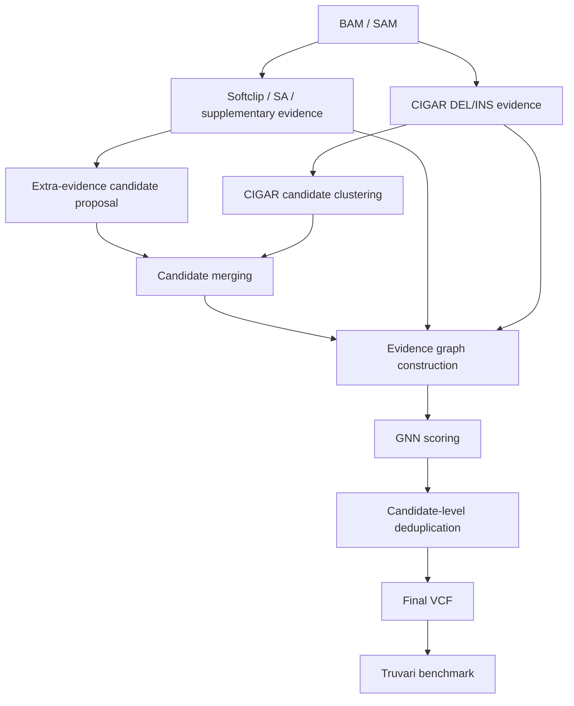

# ReadGraphSV

ReadGraphSV is a research prototype for long-read structural variant analysis.
It converts evidence from BAM alignments into region-level read evidence graphs
and uses a graph neural network (GNN) to score candidate DEL/INS variants.

The current project is best viewed as a long-read DEL/INS candidate scoring
framework based on read evidence graphs and GNNs. It is not yet a complete
all-type SV caller. DUP, INV, TRA/BND, and complex SVs are planned future work.

## Project Overview

ReadGraphSV starts from long-read BAM/SAM alignments and extracts several types
of evidence around candidate structural variants:

- CIGAR-derived deletion and insertion events.
- Soft-clipped read ends.
- SA-tag connections.
- Supplementary-alignment records.

These signals are clustered into candidate regions and converted into PyTorch
Geometric graphs. A GraphSAGE model scores each candidate, and an optional
candidate-level deduplication step removes redundant nearby calls before VCF
export and Truvari benchmarking.

### At a Glance

| Item | Current status |
|---|---|
| Main task | Long-read DEL/INS candidate scoring |
| Input | Coordinate-sorted or unsorted BAM/SAM alignment files |
| Evidence | CIGAR `D/I`, soft clips, SA tags, supplementary alignments |
| Candidate graph | Candidate node plus read evidence nodes |
| Model | GraphSAGE graph-level binary classifier |
| Output | Filtered candidate TSV and symbolic DEL/INS VCF |
| Latest recommended mode | v0.3 with extra candidates and optional deduplication |
| Final benchmark | HG002 chr21 held-out DEL/INS benchmark with Truvari |

### What Is New in v0.3

ReadGraphSV v0.3 keeps the v0.2 GNN and graph construction interface, then adds
two optional post-v0.2 workflow improvements:

- Extra-evidence candidate proposal from softclip, SA-tag, and supplementary
  signals.
- Candidate-level deduplication after GNN filtering to reduce redundant nearby
  calls.

## Key Features

- Directly reads long-read BAM/SAM files with `pysam`.
- Supports DEL and INS candidate generation and scoring.
- Builds graph datasets with candidate, CIGAR evidence, and extra evidence
  nodes.
- Supports optional v0.3 extra-evidence candidate proposal and candidate
  merging.
- Supports optional NMS-style candidate-level deduplication after GNN scoring.
- Exports symbolic DEL/INS VCF records with `GT` FORMAT and contig headers.
- Includes training, prediction, evaluation, Truvari benchmark, threshold
  sweep, and final result generation scripts.
- Keeps experimental data, models, graph datasets, and large outputs outside
  Git by default.

## Workflow



## Installation

Create a conda environment:

```bash
conda env create -f environment.yml
conda activate readgraphsv
```

Or install from requirements:

```bash
pip install -r requirements.txt
```

For development:

```bash
pip install -r requirements-dev.txt
python -m pytest -q
python -m ruff check .
```

PyTorch Geometric installation may depend on your CUDA and PyTorch versions. If
the plain install fails, use the official PyG wheel instructions for your
system.

## Quick Start

The recommended v0.3 inference command enables extra-evidence candidate
proposal and candidate-level deduplication:

```bash
python run_readgraphsv_v2.py \
  --bam real_data/HG002_chr21/bam/HG002_chr21.bam \
  --model models/readgraph_gnn_v3_extra_candidates_chr20_chr22.pt \
  --outdir runs/HG002_chr21_v3 \
  --truth real_data/HG002_chr21/truth_chr21/HG002_chr21_DELINS_50.vcf.gz \
  --threshold 0.65 \
  --min_size 50 \
  --cluster_window 500 \
  --min_support 1 \
  --extra_window 1000 \
  --read_edge_window 100 \
  --max_dist 500 \
  --min_size_sim 0.5 \
  --use_extra_candidates \
  --extra_candidate_window 500 \
  --min_softclip_support 10 \
  --min_sa_support 2 \
  --min_supplementary_support 2 \
  --min_extra_only_support 30 \
  --use_dedup \
  --dedup_window 500 \
  --dedup_min_size_sim 0.5
```

For inference without a truth VCF, omit `--truth`. The pipeline will still
build candidate graphs and produce predictions, filtered candidates, and VCF
output.

### Common Command-Line Entry Points

```bash
# Extract CIGAR-derived DEL/INS evidence
python extract_cigar_events.py --bam aligned.bam --min_size 50 --out data/signals.tsv

# Extract v0.2 extra evidence
python extract_extra_events.py --bam aligned.bam --min_clip 50 --out data/extra_signals.tsv

# Cluster CIGAR evidence into raw candidates
python cluster_events.py --signals data/signals.tsv --window 500 --min_support 1 --out data/candidates.tsv

# Propose v0.3 extra-evidence candidates
python extra_candidate_proposer.py --extra data/extra_signals.tsv --out data/extra_candidates.tsv

# Merge CIGAR and extra candidates
python merge_candidates_v3.py --cigar-candidates data/candidates.tsv --extra-candidates data/extra_candidates.tsv --out data/candidates_v3_merged.tsv

# Build enhanced graph dataset
python build_graph_dataset_v2.py --signals data/signals.tsv --extra data/extra_signals.tsv --candidates data/candidates_labeled.tsv --out graphs/dataset_v2.pt

# Train or fine-tune a GraphSAGE model
python train_gnn.py --dataset graphs/dataset_v2.pt --model_out models/readgraph_gnn.pt --epochs 100

# Predict candidate probabilities
python predict_gnn.py --dataset graphs/dataset_v2.pt --model models/readgraph_gnn.pt --out results/predictions_v2.tsv
```

## ReadGraphSV v0.3 Recommended Command

The v0.3 mode is optional and keeps the v0.2 graph/model pipeline compatible.
It is enabled by two flags:

```bash
--use_extra_candidates
--use_dedup
```

`--use_extra_candidates` adds extra-evidence candidate proposal and CIGAR/extra
candidate merging. `--use_dedup` runs candidate-level deduplication after GNN
filtering and writes a deduplicated VCF.

Recommended v0.3 validation/test settings:

```text
threshold = 0.65
extra_candidate_window = 500
min_softclip_support = 10
min_sa_support = 2
min_supplementary_support = 2
min_extra_only_support = 30
dedup_window = 500
dedup_min_size_sim = 0.5
```

## Output Files

Default v0.2-compatible outputs:

```text
outdir/data/signals.tsv
outdir/data/candidates.tsv
outdir/data/extra_signals.tsv
outdir/data/candidates_for_graph.tsv
outdir/graphs/dataset_v2.pt
outdir/results/predictions_v2.tsv
outdir/results/filtered_candidates.tsv
outdir/vcf/filtered.vcf
```

If `--truth` is provided:

```text
outdir/data/candidates_labeled.tsv
outdir/results/evaluation_v2.txt
```

If `--use_extra_candidates` is enabled:

```text
outdir/data/extra_candidates.tsv
outdir/data/candidates_v3_merged.tsv
```

If `--use_dedup` is enabled:

```text
outdir/results/filtered_candidates_dedup.tsv
outdir/results/dedup_summary.txt
outdir/vcf/filtered_dedup.vcf
```

## Benchmark Results

Final HG002 chr21 held-out DEL/INS benchmark:

| Method | Precision | Recall | F1 | TP | FP | FN |
|---|---:|---:|---:|---:|---:|---:|
| ReadGraphSV v0.2 real-finetuned | 0.897143 | 0.887006 | 0.892045 | 157 | 18 | 20 |
| ReadGraphSV v0.3 trained | 0.898305 | 0.898305 | 0.898305 | 159 | 18 | 18 |
| ReadGraphSV v0.3 trained + dedup | 0.929412 | 0.892655 | 0.910663 | 158 | 12 | 19 |
| Sniffles2 | 0.923497 | 0.954802 | 0.938889 | 169 | 14 | 8 |
| cuteSV | 0.822967 | 0.971751 | 0.891192 | 172 | 37 | 5 |
| SVIM | 0.497024 | 0.943503 | 0.651072 | 167 | 169 | 10 |

ReadGraphSV v0.3 + dedup outperformed cuteSV and SVIM in F1 and achieved higher
precision than Sniffles2, while Sniffles2 remained the strongest overall caller
due to higher recall and F1.

Detailed final result files:

```text
results/final_hg002_chr21/readgraphsv_v3_final_comparison.tsv
results/final_hg002_chr21/README_final_results.md
```

## Reproducibility

Recommended reproducibility protocol:

- Use `environment.yml` or the pinned `requirements.txt` files.
- Keep large BAMs, graph datasets, model checkpoints, and raw benchmark outputs
  outside Git.
- Select model threshold on validation data. For v0.3, `threshold=0.65` was
  selected on HG002 chr19 validation data.
- Select deduplication parameters on validation data. For v0.3, chr19
  validation supported `dedup_window=500` and `dedup_min_size_sim=0.5`.
- Use held-out chromosomes for final reporting. HG002 chr21 was used only as
  held-out test data for the final table.

Truvari benchmark parameters used for the final HG002 chr21 benchmark:

```bash
truvari bench \
  --includebed <Tier1 BED> \
  --passonly \
  --refdist 500 \
  --pctsize 0.5 \
  --sizemin 50 \
  --pctseq 0
```

Related helper scripts:

```text
scripts/benchmark_truvari_delins.py
scripts/truvari_threshold_sweep.py
scripts/write_final_v3_results.py
```

Extended project notes:

```text
docs/workflow.md
docs/usage.md
docs/benchmark.md
```

## Project Structure

```text
readgraphsv/
├── extract_cigar_events.py          # CIGAR DEL/INS signal extraction
├── extract_extra_events.py          # softclip, SA tag, supplementary evidence
├── cluster_events.py                # CIGAR candidate clustering
├── extra_candidate_proposer.py      # v0.3 extra-evidence candidate proposal
├── merge_candidates_v3.py           # CIGAR/extra candidate merging
├── build_graph_dataset.py           # v0.1 graph builder
├── build_graph_dataset_v2.py        # v0.2/v0.3 graph builder
├── train_gnn.py                     # GraphSAGE training
├── predict_gnn.py                   # GNN inference
├── dedup_filtered_candidates.py     # optional candidate-level deduplication
├── run_readgraphsv.py               # v0.1 one-command wrapper
├── run_readgraphsv_v2.py            # v0.2/v0.3 one-command wrapper
├── export_vcf.py                    # VCF export
├── scripts/                         # benchmark and final-result utilities
├── tests/                           # pytest suite
├── docs/                            # extended usage and benchmark notes
├── data/ graphs/ models/ results/   # local generated outputs
└── requirements.txt / environment.yml
```

## Current Scope and Limitations

- Current versions mainly support DEL and INS.
- ReadGraphSV is not yet a complete all-type SV caller.
- DUP, INV, TRA/BND, and complex SVs are future work.
- Current VCF records use symbolic DEL/INS alleles and simple genotype output.
- Current best use is method research: candidate generation, read evidence
  graph construction, GNN scoring, filtering, and benchmarking.

## Roadmap

- **v0.1**: CIGAR-based DEL/INS candidate graph scoring.
- **v0.2**: Add softclip, SA tag, and supplementary alignment evidence into
  graph features.
- **v0.3**: Add extra-evidence candidate proposal, candidate merging, GNN
  scoring, and optional candidate-level deduplication.
- **v0.4**: Add edge attributes, breakpoint refinement, and representation
  correction.
- **v0.5**: Extend from DEL/INS to DUP, INV, TRA/BND, and complex SVs.

## Citation / Contact

Citation information will be added when the method manuscript or preprint is
available.

Contact placeholder: please open a GitHub issue or contact the project
maintainer for questions about reproducing the benchmark.
